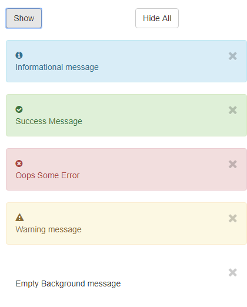

Native Angular Toaster Module (ngx-toaster)
==============================================

The library provides a toast notification which is written in native Angular and it is dependent on bootstrap, angular native animation.

<p align="center">
    
</p>

## Guide:

 1. Install the ngx-toaster using npm
    `npm install ngx-toaster`
   - **Note** : Use the regular npm flags such as 
         - `--save` to include under dependencies in `package.json`.
         - `-g` to install it globally
         
*************************

 2. Add `ToasterModule` to AppModule by importing it from `ngx-toaster` package 
```
    import { ToasterModule } from 'ngx-toaster/src/lib';
    
    @NgModule({
      imports: [ToasterModule],
      ...
    })
    export class AppModule {
    }
```
*************************

 3. As this library uses Angular animations. `BrowserAnimationsModule` should also be imported to the `app.module`. 
 - **Note** : Further exploration of `@angular/animations` module can be referred [**here**](https://angular.io/guide/animations#animations), official documentation.
 
 ```
    import { BrowserAnimationsModule } from '@angular/platform-browser/animations';

    @NgModule({
      imports: [BrowserAnimationsModule],
      ...
    })
    export class AppModule {
    }
```
 
     
*************************

  4. **Create a placeholder** for the `ngx-toast-notification` componenet in your `app.component.html`
```
    <ngx-toast-notification></ngx-toast-notification>
```

*************************

  5. Inject the **ToasterService** into your component
```
    constructor(private toasterService: ToasterService) { }
```

*************************

  6. The **toast message configuration** contains following properties<br/>

|**Property**    | **Data Type** |  **Mandatory**   |   **Default Value**     |               **Usage**                            |
| ------------   |  ----------   |  --------------  |  ---------------------  |  ----------------------------------------------    |
| id              |   string      |       No         |   ----------            |  Auto generated for each notification             |
| message         |   string      |       Yes        |   ----------            |  The user defined toast message                   |
| autoHide        |   boolean     |       No         |     true                |  This will hide the message                       |
| displayDuration |   number      |       No         |     5000(milli seconds) |  Timeout Duration can be set using this property  |
| showCloseButton |   boolean     |       No         |     true                |  Close button can be seen for manually closing it |
| toastType       |   ToastType   |       Yes        |   ----------            |  Type of the toast message can be set htere       |

- where `ToastType` is a enumeration type that determines the type of the notification which takes a five values viz.,
    * ERROR
    * WARNING>
    * SUCCESS
    * INFORMATION
    * EMPTY

*************************

7. To **show the toast message** you should be calling the `showToastMessage()` method that takes `toastMessageConfiguration` as its argument
  ```
    let toastNotificationConfiguration: ToastNotificationConfiguration = {
              message: 'Sample Toast message',
              displayDuration: 1000,
              autoHide: true,
              showCloseButton: true,
              toastType: ToastType.INFORMATION
     };
     this.toasterService.showToastMessage(toastNotificationConfiguration);
  ```
*************************

8. To **manually close** a particular toast message set the `autoHide` property as `false` and `showCloseButton` property as `true` which displays a close button using which the message can be manually closed.

*************************

9. To **hide all** the toast messages you should be using the `clearAllToastMessages()` method.
  ```
      this.toastNotificationService.clearAllToastMessages();
  ```

*************************

10. To show **multiple toast** messages you can call the `showToastMessage()` multiple times by configuring the notification object as you wish
  ```
    let informationalToastNotificationConfiguration: ToastNotificationConfiguration = {
              message: 'Informational Toast message',
              displayDuration: 1000,
              autoHide: true,
              showCloseButton: false,
              toastType: ToastType.INFORMATION
     };
      this.toasterService.showToastMessage(informationalToastNotificationConfiguration);
      
      let errorToastNotificationConfiguration: ToastNotificationConfiguration = {
              message: 'Error Toast message',
              autoHide: false,
              toastType: ToastType.ERROR
      };
      this.toasterService.showToastMessage(errorToastNotificationConfiguration);
      
      let successToastNotificationConfiguration: ToastNotificationConfiguration = {
              message: 'Success Toast message',
              autoHide: false,
              toastType: ToastType.SUCCESS
      };      
      
      this.toasterService.showToastMessage(successToastNotificationConfiguration);
  ```
  
For LIVE DEMO checkout the [plunker](https://plnkr.co/edit/ae4rj2eq8oZEeK8pN6RN?p=preview)
